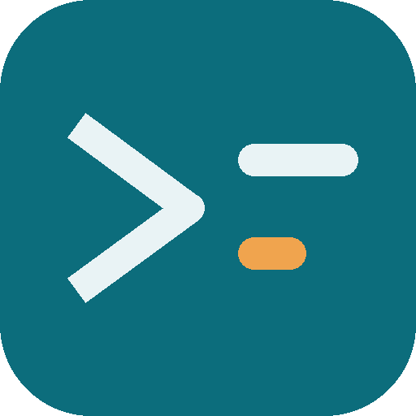

<p align="center">
  
</p>

<h1 align="center">Stride</h1>

<p align="center">
  <a href="https://stride-devgusta5.vercel.app">stride-devgusta5.vercel.app</a>
</p>

<p align="center">
  
  <br>
  <sub>Aponte a câmera para abrir e instalar como app</sub>
</p>

PWA de acompanhamento de um plano de estudos de 25 dias para preparação técnica de
processo seletivo: algoritmos, live coding, JavaScript, Web e Backend.

Estático, sem build e sem dependências. Funciona offline depois da primeira abertura e pode
ser instalado no Android, iOS e desktop.

## Stack

HTML + CSS + JS puro, sem framework, sem bundler e sem `node_modules`. Todo o app roda em um
único arquivo. Isso torna o projeto fácil de clonar, editar e publicar em qualquer host
estático — não há passo de build.

```
index.html              o app inteiro (HTML + CSS + JS num arquivo só)
manifest.webmanifest    nome, ícones, cor e modo standalone
sw.js                   service worker: cache offline
icons/                  ícones 192, 512 e maskable
```

## Funcionalidades

- Trilha de N dias, abrindo direto no dia atual
- Exercícios do dia com link para LeetCode e documentação
- Cronômetro para simulados e live coding (configurável por dia)
- Anotações por dia, salvas automaticamente
- Checklist de conhecimentos por tema (ex.: Algoritmos, JavaScript, Web, Backend)
- Progresso salvo no `localStorage`, com exportar/importar em JSON
- Tema claro e escuro

## Rodar local

```bash
npx serve .          # ou: python3 -m http.server 8080
```

Abra `http://localhost:8080`. Em `localhost` o service worker registra normalmente.

> **Service worker só funciona em HTTPS** (ou em `localhost`). Abrir o `index.html` com duplo
> clique — `file://` — não registra o SW e não instala como app.

## Instalar como app

- **Android/Chrome:** botão **Instalar app** no rodapé, ou menu ⋮ → *Instalar aplicativo*.
- **Desktop (Chrome/Edge):** ícone de instalar na barra de endereço.
- **iOS/Safari:** Compartilhar → *Adicionar à Tela de Início* (o iOS ignora o prompt automático).

### APK (Android)

Empacotado com o [PWABuilder](https://www.pwabuilder.com/) a partir do manifest do próprio
site. É um instalável fora da Play Store, então o Android vai pedir permissão de **instalar
apps de fontes desconhecidas** na primeira vez.

<p align="center">
  <a href="https://stride-devgusta5.vercel.app/download/stride.apk">
    
  </a>
  <br>
  <sub>Baixar <code>stride.apk</code></sub>
</p>

## Progresso

Fica no `localStorage`, por dispositivo — não sincroniza sozinho entre celular e PC. Use
**Exportar progresso** / **Importar progresso** no rodapé para passar de um dispositivo para
outro. Limpar os dados do site apaga o progresso.

## Editar o conteúdo

Tudo mora no `index.html`:

- `const DIAS = [...]` — os dias do plano: `d` (número), `date`, `title`, objetivo, exercícios
  (`ex`) e perguntas (`qs`). Em cada exercício, `s:"lc"` marca link do LeetCode, `s:"doc"`
  leitura/documentação, `s:"task"` tarefa sem link.
- `kind:"sim"` marca dia de simulado/avaliação, `kind:"rest"` descanso, `timer: 60` liga o
  cronômetro com N minutos.
- `CHECKLIST` e `RECURSOS` — as outras duas abas do app (temas de estudo e links de referência).
- `manifest.webmanifest` — nome do app, cores e ícones exibidos ao instalar.

Depois de editar, **incremente `VERSION` no `sw.js`** (`v1` → `v2`) e publique de novo. Sem
isso o navegador continua servindo a versão antiga em cache.

### Livro de referência

Os capítulos citados em cada dia (campo `book`) seguem *Entendendo Algoritmos* (Aditya
Bhargava), que foi o livro disponível na hora de montar essa trilha — não é uma dependência
do projeto. Para usar outra referência, basta trocar o texto de `book:"..."` em cada dia do
`DIAS` pelo capítulo/seção correspondente do seu material.
